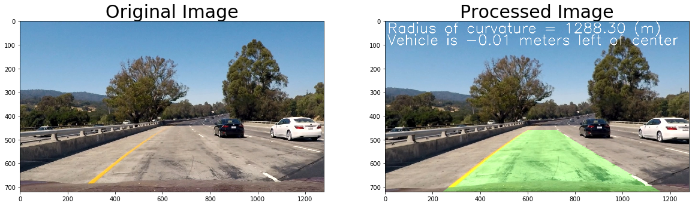

## Advanced Lane Finding

Overview
---

This repository is to submit the project outcome of [Udacity - Self-Driving Car NanoDegree - Advance Lane Lines project](https://github.com/udacity/CarND-Advanced-Lane-Lines)

The goals / steps of this project are the following:

* Compute the camera calibration matrix and distortion coefficients given a set of chessboard images.
* Apply a distortion correction to raw images.
* Use color transforms, gradients, etc., to create a thresholded binary image.
* Apply a perspective transform to rectify binary image ("birds-eye view").
* Detect lane pixels and fit to find the lane boundary.
* Determine the curvature of the lane and vehicle position with respect to center.
* Warp the detected lane boundaries back onto the original image.
* Output visual display of the lane boundaries and numerical estimation of lane curvature and vehicle position.

Contents
---

1. [README](README.md)
1. Code
   1. [lane_lines.ipynb](lane_lines.ipynb) : Main program to execute pipeline
   1. [calib_cam.py](calib_cam.py) : Program to calculate calibration data of camera
1. [Writeup Report](writeup_report.md)
1. [Output Video](output_videos/project_video.mp4)
1. [Output Images](output_images/)

LICENSE
---

MIT License
